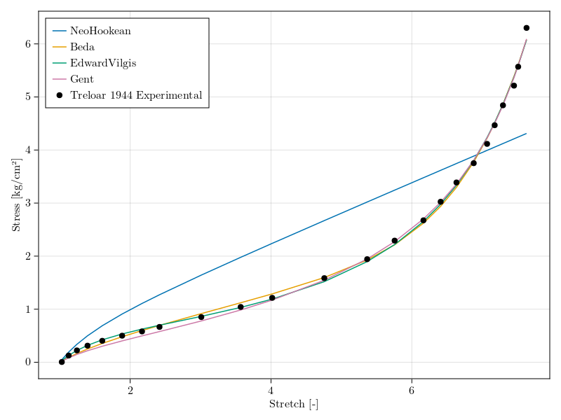

# Summary

`Hyperelastics.jl` is a Julia [@Bezanson2017]  implementation for the largest (70+) collection of hyperelastic material models in existence. The package provides a set of analytical and data-driven strain energy density functions (SEDF) and the tools required to calibrate the models to material tests. The package is designed to leverage multiple-dispatch to define a common set of functions for calculating the SEDF, Second Piola Kirchoff stress tensor, and the Cauchy stress tensor. The package provides: 1) a material model library that is AD compatible and 2) a set of extensible methods for easily defining and testing new material models. The package leverages the `ContinuumMechanicsBase.jl` pacakge for defining the continuum scale quantities and their corresponding relationships.

# Statement of Need

The development of `Hyperelastics.jl` began as a study of the accuracy for a variety of material models for a set of experimental data. Often, researchers rely on custom implementations of material models and the data fitting process to find material parameters that match their experimental data. Hyperelastic models can well represent the nonlinear stress-deformation behavior of many biological tissues as well as engineering polymeric materials.

The SEDFs included in this package cover most (if not all) of the available analytical models from the literature to date, from constitutive to phenomelogical models. Furthermore, a selection of data-driven models are incldued as a starting point for the development of new methods.

`Hyperelastics.jl` is part of a spinoff Multi-Scale Material Modelling ($M^3$) Suite being developed by Vagus LLC (wwww.vagusllc.com), as a byproduct result of ongoing multi-functional material research being carried out in the Translational Robotics and Controls Engineering Research (TRACER) Lab at Liberty University. A pure Julia implementation allows for the use of automatic differentiation (AD) packages to calculate the partial derivatives of the SEDF. `Hyperelastics.jl` is designed to leverage multiple-dispatch to define a common set of functions for calculating the SED, Second Piola Kirchoff Stress Tensor, and the Cauchy Stress Tensor. The package provides a set of hyperelastic models and an interface to `Optimization.jl` for fitting model parameters. 

Currently, most commercial finite element codes only offer a limited number, often less than 10, of hyperelastic models which limits the extent to which researchers are able to accurately model a given material. The closest project to `Hyperelastics.jl` is the `matADi` project by Andreas Dutzler [@matAdi2023] which has AD support for 18 material models. 

# Short Example with Code

For commonly used datasets in hyperelastic modelling, such as the `Treloar1944Uniaxial` data [@treloar1943elasticity]\autoref{fig:fig1}, functions are available for getting the datasets:

```julia
using Hyperelastics
using Optimization, OptimizationOptimJL
using ComponentArrays: ComponentVector
using ForwardDiff
using CairoMakie, MakiePublication
set_theme!(theme_web(width = 800))
f = Figure()
ax = Axis(f[1,1])
treloar_data = Treloar1944Uniaxial()
scatter!(ax, 
    getindex.(treloar_data.data.λ, 1), 
    getindex.(treloar_data.data.s, 1), 
    label = "Treloar 1944 Experimental",
    color = :black
)
axislegend(position = :lt)
```

Multiple dispatch is used on the corresponding function to calculate the values. Based on the model passed to the function, the correct method will be used in the calculation. StrainEnergyDensity, SecondPiolaKirchoffStressTensor, and CauchyStressTensor accept the deformation state as either the principal components in a vector, $[\lambda_1, \lambda_2, \lambda_3]$ or as the deformation gradient matrix, $F_{ij}$. The returned value matches the type of the input. Parameters are accessed by field allowing for `structs`, `NamedTuples`, or other field-based data-types such as those in ComponentArrays.jl and LabelledArrays.jl. For example, the NeoHookean model is accessed with:

```julia
ψ = NeoHookean()
λ_vec = [2.0, sqrt(1/2), sqrt(1/2)]
p = (μ = 10.0, )
W = StrainEnergyDensity(ψ, λ_vec, p)
```

or

```julia
F = rand(3,3)
p = (μ = 20.0, )
W = StrainEnergyDensity(ψ, F, p)
```

A method for creating an `OptimizationProblem` compatible with `Optimization.jl` is provided. To fit the NeoHookean model to the Treloar data previously loaded, an additional field-indexed array is used as the initial guess to `HyperelasticProblem`. It is recommendedto use ComponentArrays.jl for optimization of model parameters.

```julia
prob = HyperelasticProblem(
        ψ, 
        treloar_data, 
        ComponentVector(μ = 0.2), 
        ad_type = AutoForwardDiff()
    )
sol = solve(prob, LBFGS())
```

For fiting multiple models, such as the Gent[@gent1996new], Edward-Vilgis [@edwards1986effect], Neo-Hookean [@treloar1979non], and Beda [@beda2005reconciling] models, to the same Treloar dataset:

```julia
models = Dict(
    Gent => ComponentVector(
                μ=240e-3, 
                J_m=80.0
            ),
    EdwardVilgis => ComponentVector(
                Ns=0.10, 
                Nc=0.20, 
                α=0.001, 
                η=0.001
            ),
    NeoHookean => ComponentVector(
                μ=200e-3
            ),
    Beda => ComponentVector(
                C1=0.1237, 
                C2=0.0424, 
                C3=7.84e-5, 
                K1=0.0168, 
                α=0.9, 
                β=0.68, 
                ζ=3.015
            )
)

sol = Dict{Any, SciMLSolution}()
for (ψ, p_0) in models
    HEProblem = HyperelasticProblem(
        ψ(), 
        treloar_data, 
        p_0,  
        ad_type = AutoForwardDiff()
    )
    sol[ψ] = solve(HEProblem, NelderMead())
end
```

To predict the reponse of a model to a proivded dataset and parameters, a `predict` function is provided. The results are shown in \autoref{fig:fig1}:

```julia
f = Figure()
ax = Axis(f[1,1])
for (ψ, p) in sol
    pred = predict(
        ψ(), 
        treloar_data, 
        p.u, 
        ad_type = AutoForwardDiff()
    )
    lines!(
        ax, 
        getindex.(pred.data.λ, 1), 
        getindex.(pred.data.s, 1), 
        label=string(ψ)
    )
end
scatter!(ax, 
    getindex.(treloar_data.data.λ, 1), 
    getindex.(treloar_data.data.s, 1), 
    label = "Treloar 1944 Experimental", 
    color = :black
)
axislegend(position = :lt)
```



While the majority of the models provided by `Hyperelastics.jl` are based on closed form strain energy density functions, a selection of data-driven models are proivded. For example, the `SussmanBathe` [@sussman2009model] model is created and used to predict the Treloar data \autoref{fig:fig3}:

```julia
using DataInterpolations
ψ = SussmanBathe(treloar_data, k=4, interpolant = QuadraticSpline)
λ_1 = range(extrema(getindex.(treloar_data.data.λ, 1))..., length = 100)
uniaxial_prediction = HyperelasticUniaxialTest(λ_1, name = "Prediction")
pred = predict(ψ, uniaxial_prediction, [])
λ_1 = getindex.(treloar_data.data.λ, 1)
s_1 = getindex.(treloar_data.data.s, 1)
λ_hat_1 = getindex.(pred.data.λ, 1)
s_hat_1 = getindex.(pred.data.s, 1)


f, ax, p = lines( 
    λ_hat_1, 
    s_hat_1, 
    label = "Sussman-Bathe Approximation"
)

scatter!(
        ax,
        λ_1, 
        s_1, 
        label = "Treloar 1944 Experimental",
        color = :black
    )
axislegend(position = :lt)
```


# Availability

Hyperelastics.jl can be found on [github](https://github.com/TRACER-LULab/Hyperelastics.jl).

# Acknowledgements

The TRACER Lab is supported by the School of Engineering and the Center for Engineering Research and Education (CERE) at Liberty University.

# References